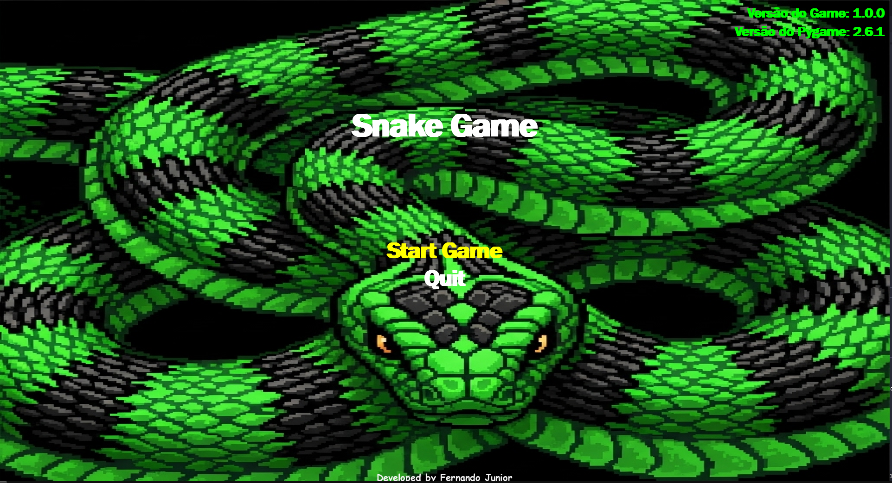
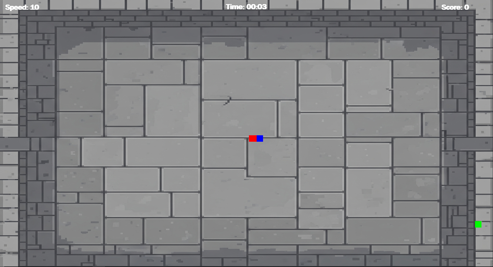

# 🐍 Snake Game – Versão 1.1  

Um projeto desenvolvido em **Python** com a biblioteca **Pygame**, recriando o clássico e viciante jogo da cobrinha com um toque moderno.  
Esta versão traz novas animações, melhorias visuais e novas funções que deixam o gameplay ainda mais divertido!  

---

## 🚀 Tecnologias Utilizadas  

- 🐍 **Python 3**  
- 🎮 **Pygame**  
- 💡 **Lógica de programação estruturada**  

---

## 🎯 Objetivo do Jogo  

O objetivo é simples: **controlar a cobra** para comer os alimentos que aparecem na tela, **crescendo cada vez mais** sem colidir com o próprio corpo.  
A cada alimento consumido, a velocidade aumenta, testando seus reflexos e coordenação!

---

## 🆕 Novidades da Versão 1.1  

- ✨ **Animação ao comer:** agora a cobra reage com uma pequena animação a cada alimento consumido.  
- 🖥️ **Modo Fullscreen:** jogue em tela cheia e mergulhe na nostalgia.  
- 🎨 **HUDs aprimoradas:** design mais limpo e moderno.  
- 🎬 **Tela de introdução:** uma intro antes do início da partida, tornando o jogo mais imersivo.  

---

## 🧩 Lógica do Jogo  

O projeto utiliza a **biblioteca Pygame** para lidar com os gráficos, eventos e atualizações de tela.  
A cobra é formada por uma **lista de coordenadas**, que cresce a cada alimento consumido.  
As colisões são verificadas com base nas posições dos blocos, garantindo uma lógica simples, mas eficiente.

---

## 🎮 Como Jogar  

1. **Execute o arquivo principal:**  
   ```bash
    python Snake.py  (para executar o projeto.)
2. **Execute o arquivo .exe:**
Na pasta raiz do projeto copie o arquivo **Snake-Game_v1.1.exe** para aréa de trabalho.
Agora execute o arquivo **Snake-Game_v1.1.exe** é uma versão compilada do game.

-Use as setas do teclado para mover a cobra ou joystick com analógico esquerdo.
-Evite colidir com as paredes ou com o próprio corpo.

Divirta-se! 🕹️

💬 Sobre o Projeto

O Snake Game foi criado com o objetivo de praticar lógica de programação e desenvolver habilidades em desenvolvimento de jogos com Pygame.
Além de ser um ótimo exercício técnico, é também um jogo divertido, leve e nostálgico, que pode ser jogado a qualquer momento.

📸 Capturas de Tela




🧠 Autor

Fernando Junior
🎓 Desenvolvedor de Jogos Digitais | 💻 Freelancer em Desenvolvimento de Jogos e Aplicações
📧 [fernandoolivirajunior@gmail.com | www.linkedin.com/in/fernando-junior-ff]
